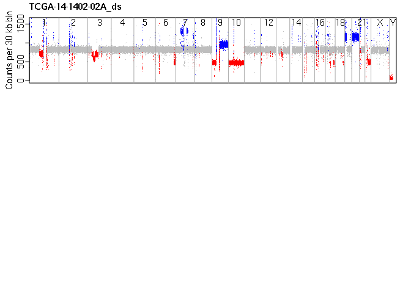

<!-- README.md is generated from README.Rmd. Please edit that file -->

# BACDAC

<!-- badges: start -->
<!-- badges: end -->

BACDAC is an R package for “Ploidy Analysis using the Binomial Allelic
Content with Discretization Algorithm and Constellation plot”

Reports tumor ploidy and purity from whole-genome sequencing data
including low-pass low-tumor NGS.

Inputs include read-depth and segmentation data, and ref/alt counts for
common single nucleutide polymorphisms (SNPs). Calculates the
“Heterozygosity Score” and produces the Constellation plot to visualize
allele-specific copy-number as shown in publication xyz.

## Installation

install BACDAC using R: `devtools::install_github('vasmatzis/BACDAC')`

## Example

This is a quick example to confirm you can load example data from the
package and use one of the simple functions. A successful attempt will
generate a linear genome plot similar to figure 3 of the publication:

``` r
## try to run this example:
  library(BACDAC)
  library(logging)

  basicConfig("DEBUG")
  sampleId='TCGA-14-1402-02A_ds'; alternateId=66301

  # inputDir: path to the package example data
  inputDir <- system.file('extdata', package = "BACDAC")
  segmentationFile <- file.path(inputDir, paste0(sampleId, '_segmentation.csv'))
  segmentation= read.csv(segmentationFile, comment.char = '#', header = TRUE) # chr, start, end, rd per segment
  segmentation=checkSegmentation(segmentation)
  thirtyKbFile=file.path(inputDir, paste0(sampleId,'_','readDepthPer30kbBin.Rds'))
  readDepthPer30kbBin = readRDS(file=thirtyKbFile )
  readDepthBinSize=readDepthPer30kbBin$windowSize

  op <- par(mfrow=c(3,1),mai=c(.25,0.5, 0.3,0.25), mgp=c(2, .5, 0))
 # default cnv color coding and annotations
 linearGenomePlot(readDepthPer30kbBin=readDepthPer30kbBin,readDepthBinSize=readDepthBinSize, sampleId=sampleId,segmentation=segmentation)
```



There are four main functions to be operated in this order:

1)  `calculateHetScore()`
2)  `calculatePloidy()`
3)  `loadStarsInTheClouds()`
4)  `plotStarsInTheClouds()`

The function `runBACDAC()` will run all steps sequentially. See the
example for help running this function.

## Reference files

Two reference files are also required. These are available at….

1)  hsNormMat
2)  testVals

## Sample input Files

There are four types of input files required for each sample you wish to
test. The contents and any required file naming scheme are described
below. Example data is included with the package for testing and
illustration of the expected structure and format of the data. This data
also allows for full demonstration of the BACDAC features. The included
data is from sample TCGA-14-1402-02A which was down-sampled to a base
coverage of 5x and then processed through our pipelines BIMA and
svaTools. We gave the sample the sampleId: `TCGA-14-1402-02A_ds`. All
the input files are located in a single directory, the `inputDir`. The
required infput files are as follows:

1)  refAltCount data:

23 files, one file for each chromosome 1-22 and X. The file is a matrix
with four columns: chr pos ref alt. The file must be in `inputDir` and
the file name is of the form `<sampleId>_1.Rds`, saved using `saveRDS()`

``` r
# example files in the package
inputDir <- system.file('extdata', package = "BACDAC")
sampleId='TCGA-14-1402-02A_ds';

dir(inputDir, pattern = 'refAltCount')
#>  [1] "TCGA-14-1402-02A_ds_refAltCount_1.Rds" 
#>  [2] "TCGA-14-1402-02A_ds_refAltCount_10.Rds"
#>  [3] "TCGA-14-1402-02A_ds_refAltCount_11.Rds"
#>  [4] "TCGA-14-1402-02A_ds_refAltCount_12.Rds"
#>  [5] "TCGA-14-1402-02A_ds_refAltCount_13.Rds"
#>  [6] "TCGA-14-1402-02A_ds_refAltCount_14.Rds"
#>  [7] "TCGA-14-1402-02A_ds_refAltCount_15.Rds"
#>  [8] "TCGA-14-1402-02A_ds_refAltCount_16.Rds"
#>  [9] "TCGA-14-1402-02A_ds_refAltCount_17.Rds"
#> [10] "TCGA-14-1402-02A_ds_refAltCount_18.Rds"
#> [11] "TCGA-14-1402-02A_ds_refAltCount_19.Rds"
#> [12] "TCGA-14-1402-02A_ds_refAltCount_2.Rds" 
#> [13] "TCGA-14-1402-02A_ds_refAltCount_20.Rds"
#> [14] "TCGA-14-1402-02A_ds_refAltCount_21.Rds"
#> [15] "TCGA-14-1402-02A_ds_refAltCount_22.Rds"
#> [16] "TCGA-14-1402-02A_ds_refAltCount_3.Rds" 
#> [17] "TCGA-14-1402-02A_ds_refAltCount_4.Rds" 
#> [18] "TCGA-14-1402-02A_ds_refAltCount_5.Rds" 
#> [19] "TCGA-14-1402-02A_ds_refAltCount_6.Rds" 
#> [20] "TCGA-14-1402-02A_ds_refAltCount_7.Rds" 
#> [21] "TCGA-14-1402-02A_ds_refAltCount_8.Rds" 
#> [22] "TCGA-14-1402-02A_ds_refAltCount_9.Rds" 
#> [23] "TCGA-14-1402-02A_ds_refAltCount_X.Rds"
# load
refAltCountchr1=readRDS(file.path(inputDir, paste0(sampleId, '_refAltCount_1.Rds')))
# preview
head(refAltCountchr1)
#>   chr   pos ref alt
#> 1   1 11012   4   0
#> 2   1 11063   3   0
#> 3   1 13110   2   0
#> 4   1 13116   2   0
#> 5   1 13118   1   0
#> 6   1 13273  10   0
str(segmentation)
#> 'data.frame':    690 obs. of  5 variables:
#>  $ chr     : int  1 1 1 1 1 1 1 1 1 1 ...
#>  $ start   : num  1 515000 709000 818000 919000 ...
#>  $ end     : num  515000 709000 818000 919000 1021000 ...
#>  $ cnvState: int  3 3 3 3 2 2 2 2 2 2 ...
#>  $ rd      : num  1658 872 950 863 811 ...
```

2)  segmentation data:  
    One file with identified regions of the genome with constant read
    depth.  
    A data frame with required columns: chr, start, end, rd; where `rd`
    is the read depth or read count for that segment. optional column:
    cnvState (1=loss, 2=normal, 3=gain) for color coding the linear
    genome plot.  
    The bin size used for creating the segmentation file will also be
    needed.

``` r
# example files in the package
inputDir <- system.file('extdata', package = "BACDAC")
sampleId='TCGA-14-1402-02A_ds';
# file name
segmentationFile= file.path(inputDir, paste0(sampleId, '_segmentation.csv'))
# load
segmentation_org=read.csv(segmentationFile, comment.char = "#", header=TRUE)
# checks for and returns the required columns
segmentation=BACDAC::checkSegmentation(segmentation_org)
# preview
head(segmentation)
#>   chr   start     end cnvState        rd
#> 1   1       1  515000        3 1658.1929
#> 2   1  515000  709000        3  871.5000
#> 3   1  709000  818000        3  949.7500
#> 4   1  818000  919000        3  863.0000
#> 5   1  919000 1021000        2  810.7500
#> 6   1 1021000 1123000        2  825.6667
str(segmentation)
#> 'data.frame':    690 obs. of  5 variables:
#>  $ chr     : int  1 1 1 1 1 1 1 1 1 1 ...
#>  $ start   : num  1 515000 709000 818000 919000 ...
#>  $ end     : num  515000 709000 818000 919000 1021000 ...
#>  $ cnvState: int  3 3 3 3 2 2 2 2 2 2 ...
#>  $ rd      : num  1658 872 950 863 811 ...
```

3)  readDepthPer30kbBin  
    A list with two equal length arrays and one item:

- `readDepthArray` read depth for 30 kb bins, normalized for GC content
  and other artifacts
- `goodWindowArray` linear genome position of each window (bin), masked
  windows have been removed
- `readDepthBinSize` size of the bins in the read depth array, expecting
  30000 or 100000

4)  readDepthPer100kbBin  
    list with two equal length arrays and one item:

- `readDepthArray` read depth for 100 kb bins, normalized for GC content
  and other sequencing artifacts
- `goodWindowArray` linear genome position of each window (bin) (masked
  windows have been removed)
- `readDepthBinSize` size of the bins in the read depth array, expecting
  30000 or 100000

``` r
inputDir <- system.file('extdata', package = "BACDAC")
sampleId='TCGA-14-1402-02A_ds';
dir(inputDir, pattern = 'readDepthPer')
#> [1] "TCGA-14-1402-02A_ds_readDepthPer100kbBin.Rds"
#> [2] "TCGA-14-1402-02A_ds_readDepthPer30kbBin.Rds"

thirtyKbFile=file.path(inputDir, paste0(sampleId,'_','readDepthPer30kbBin.Rds'))
#load
readDepthPer30kbBin = readRDS(file=thirtyKbFile )
# preview
names(readDepthPer30kbBin)
#> [1] "readDepthArray"  "goodWindowArray" "windowSize"
str(readDepthPer30kbBin)
#> List of 3
#>  $ readDepthArray : num [1:93963] 1690 947 1746 1946 1521 ...
#>  $ goodWindowArray: int [1:93963] 2 3 4 7 10 13 14 16 17 18 ...
#>  $ windowSize     : num 30000

hundredKbFile=file.path(inputDir, paste0(sampleId,'_','readDepthPer100kbBin.Rds'))
#load
readDepthPer100kbBin = readRDS(file=hundredKbFile )
# preview
names(readDepthPer100kbBin)
#> [1] "readDepthArray"  "goodWindowArray" "windowSize"
str(readDepthPer100kbBin)
#> List of 3
#>  $ readDepthArray : num [1:26606] 5547 6540 5522 3180 2961 ...
#>  $ goodWindowArray: int [1:26606] 1 2 5 7 8 9 10 11 12 13 ...
#>  $ windowSize     : num 1e+05
```

## Linear Genome

Linear genome coordinates are used throughout for ease of indexing.
Helper functions are provided to help transform from single bp scale to
a desired bin size.

``` r
coords=BACDAC::getLinearCoordinates()
# linear coordinate for the start of each chromosome where 23=X, 24=Y
coords@chromStart[1:24]
#>          1          2          3          4          5          6          7 
#>          1  248956423  491149952  689445511  879660066 1061198325 1232004304 
#>          8          9         10         11         12         13         14 
#> 1391350277 1536488913 1674883630 1808681052 1943767674 2077042983 2191407311 
#>         15         16         17         18         19         20         21 
#> 2298451029 2400442218 2490780563 2574038004 2654411289 2713028905 2777473072 
#>         22         23         24 
#> 2824183055 2875001523 3031042418

# linear coordinate for the start of each chromosome using 30 kb bins
BACDAC::binnedPosStart(coords@chromStart[1:24], binSize=30000)
#>      1      2      3      4      5      6      7      8      9     10     11 
#>      1   8299  16372  22982  29323  35374  41067  46379  51217  55830  60290 
#>     12     13     14     15     16     17     18     19     20     21     22 
#>  64793  69235  73047  76616  80015  83027  85802  88481  90435  92583  94140 
#>     23     24 
#>  95834 101035
```
