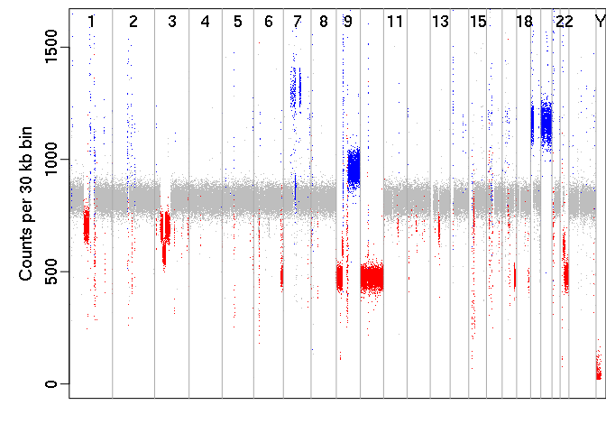

<!-- README.md is generated from README.Rmd. Please edit that file -->

# BACDAC

<!-- badges: start -->
<!-- badges: end -->

BACDAC is an R package for “Ploidy Analysis using the Binomial Allelic
Content with Discretization Algorithm and Constellation plot”

Reports tumor ploidy and purity from whole-genome sequencing data
including low-pass low-tumor NGS. Inputs include read-depth and
segmentation data, and ref/alt counts for common single nucleutide
polymorphisms (SNPs). Calculates the “Heterozygosity Score” and produces
the Constellation plot to visualize allele-specific copy-number as shown
in publication xyz.

## Installation

You can install the development version of BACDAC by cloning the
repository from the Mayo Clinic dev.azure.com (will be moved to github
eventually):

<https://dev.azure.com/mclm/GBS%20GSU/_git/bmd-bacdac>

look at the clone button and copy the SSH url.

RStudio instructions:

1)  Open RStudio: File -\> New Project -\> New repository -\> git

2)  Fill in the pop up window as follows:

- Repository URL: <git@ssh.dev.azure.com>:v3/mclm/GBS%20GSU/bmd-bacdac
- Project directory name: bacdac
- Create project as subdirectory of: <path/to/your>/Rprojects/

3)  Hit ‘create project’ and smile while RStudio does all the git clone
    stuff.

4)  Build. You can Build in Rstudio or on command line, see ‘Updating
    source code’. You will be directed to install any necessary package
    dependancies at this time.

## Updating source code

need to pull updates and build regularly during development, you can do
this on the command line or in Rstudio

### on command line:

``` r
cd <path/to/your>/Rprojects/bacdac
git pull
R CMD INSTALL --build .
```

### in Rstudio:

- go to “git” tab, click on “git pull”
- go to “Build” tab, click on “Install”

## Example

This is a quick example to confirm you can load example data from the
package and use one of the simple functions. A successful attempt will
generate a linear genome plot similar to figure 3 of the publication:

``` r
## try to run this example:
  library(BACDAC)
  library(logging)

  basicConfig("DEBUG")
  sampleId='TCGA-14-1402-02A_ds'; alternateId=66301

  # inputDir: path to the package example data
  inputDir <- system.file('extdata', package = "BACDAC")
  segmentationFile <- file.path(inputDir, paste0(sampleId, '_segmentation.csv'))
  segmentation= read.csv(segmentationFile, comment.char = '#', header = TRUE) # chr, start, end, rd per segment
  segmentation=checkSegmentation(segmentation)
  thirtyKbFile=file.path(inputDir, paste0(sampleId,'_','readDepthPer30kbBin.Rds'))
  readDepthPer30kbBin = readRDS(file=thirtyKbFile )
  readDepthBinSize=readDepthPer30kbBin$windowSize

  op <- par(mfrow=c(3,1),mai=c(.25,0.5, 0.3,0.25), mgp=c(2, .5, 0))
 # default cnv color coding and annotations
 linearGenomePlot(readDepthPer30kbBin=readDepthPer30kbBin,readDepthBinSize=readDepthBinSize, sampleId=sampleId,segmentation=segmentation)
```



There are four main functions to be operated in this order:

1)  `calculateHetScore()`
2)  `calculatePloidy()`
3)  `loadStarsInTheClouds()`
4)  `plotStarsInTheClouds()`

The function `runBACDAC()` will run all steps sequentially.

# Reference files

Two reference files are also required. These are available at….

1)  hsNormMat a heterozygosity score mask, used to find genomic
    positions where the heterozgosity score is atypically low.  

- rows: hetScores for each 30 kb segment of the genome, 1-22, X and a
  part of Y.
- columns: one column for each of the 23 normal samples

2)  testVals a pre-built array to assist finding each possible
    heterozygosity value for each copy number level

# Sample input Files

The following input files are required for each sample you wish to test:

1)  segmentation data:  
    identified regions of the genome with constant read depth.  
    data frame with required columns: chr, start, end, rd;  
    optional column: cnvState (1=loss, 2=normal, 3=gain) for color coded
    linear linear genome plot

2)  readDepthPer30kbBin  
    list with two equal length arrays and one item:

- `readDepthArray` read depth for 30 kb bins, normalized for GC content
  and other artifacts
- `goodWindowArray` linear genome position of each window (bin), masked
  windows have been removed
- `readDepthBinSize` size of the bins in the read depth array, expecting
  30000 or 100000

3)  readDepthPer100kbBin  
    list with two equal length arrays and one item:

- `readDepthArray` read depth for 100 kb bins, normalized for GC content
  and other sequencing artifacts
- `goodWindowArray` linear genome position of each window (bin) (masked
  windows have been removed)
- `readDepthBinSize` size of the bins in the read depth array, expecting
  30000 or 100000

Example files are included in this package. This example data shows you
the expected format and provides a demonstration of the tool. This data
is from sample TCGA-14-1402-02A which was down-sampled to a base
coverage of 5x and then processed through our pipelines BIMA and
svaTools.

``` r
inputDir <- system.file('extdata', package = "BACDAC")
sampleId='TCGA-14-1402-02A_ds';
thirtyKbFile=file.path(inputDir, paste0(sampleId,'_','readDepthPer30kbBin.Rds'))
readDepthPer30kbBin = readRDS(file=thirtyKbFile )

names(readDepthPer30kbBin)
#> [1] "readDepthArray"  "goodWindowArray" "windowSize"
head(readDepthPer30kbBin$readDepthArray)
#> [1] 1690  947 1746 1946 1521 1996
head(readDepthPer30kbBin$goodWindowArray)
#> [1]  2  3  4  7 10 13
```

Linear genome coordinates are used throughout for ease of indexing.
Helper functions are provided to help transform from single bp scale to
a desired bin size.

``` r
coords=getLinearCoordinates()
# linear coordinate for the start of each chromosome where 23=X, 24=Y
coords@chromStart[1:24]
#>          1          2          3          4          5          6          7 
#>          1  248956423  491149952  689445511  879660066 1061198325 1232004304 
#>          8          9         10         11         12         13         14 
#> 1391350277 1536488913 1674883630 1808681052 1943767674 2077042983 2191407311 
#>         15         16         17         18         19         20         21 
#> 2298451029 2400442218 2490780563 2574038004 2654411289 2713028905 2777473072 
#>         22         23         24 
#> 2824183055 2875001523 3031042418

# linear coordinate for the start of each chromosome using 30 kb bins
binnedPosStart(coords@chromStart[1:24], binSize=30000)
#>      1      2      3      4      5      6      7      8      9     10     11 
#>      1   8299  16372  22982  29323  35374  41067  46379  51217  55830  60290 
#>     12     13     14     15     16     17     18     19     20     21     22 
#>  64793  69235  73047  76616  80015  83027  85802  88481  90435  92583  94140 
#>     23     24 
#>  95834 101035
```
